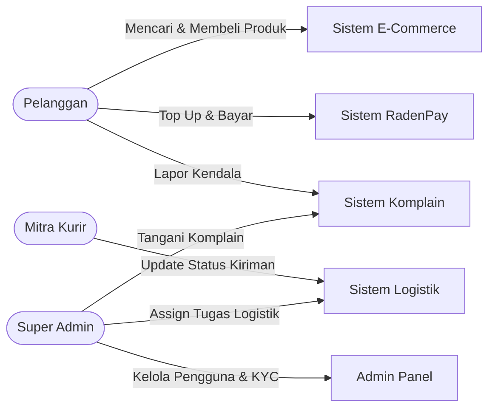
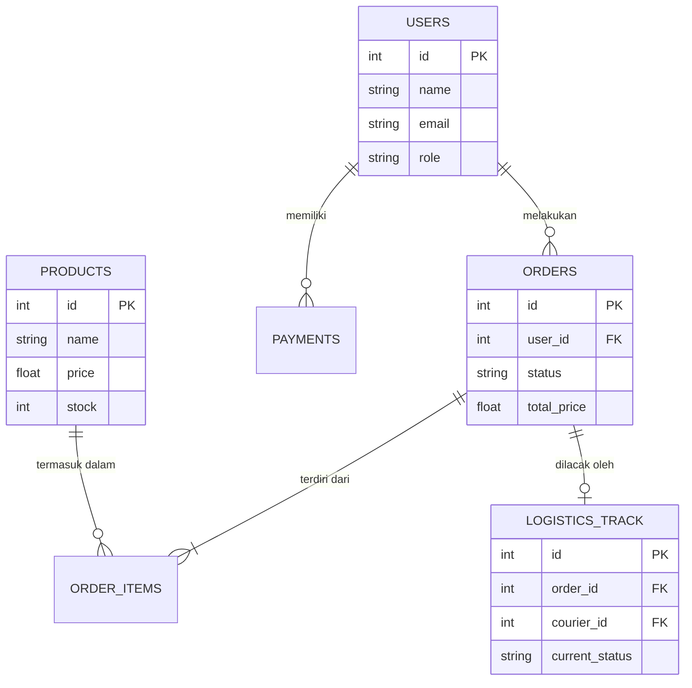
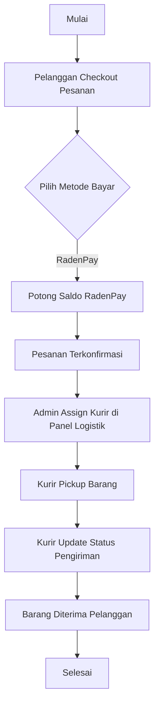
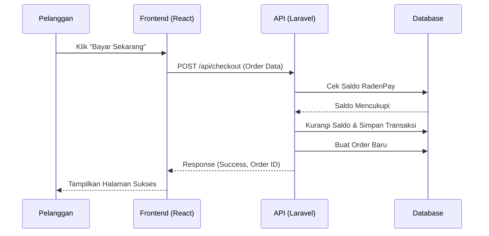

# Dokumen Perancangan & Manajemen Proyek: Radencak Shop

## Bagian 1: Project Initiation & Planning (Manajemen Proyek)

### 1. Executive Summary
Proyek **Radencak Shop** adalah inisiatif pengembangan platform *e-commerce* komprehensif yang tidak hanya menyediakan *marketplace* untuk transaksi jual-beli, tetapi juga mengintegrasikan sistem logistik mandiri dan ekosistem dompet digital terpadu (RadenPay). Urgensi proyek ini adalah untuk mengatasi fragmentasi layanan *e-commerce*, logistik, dan pembayaran yang seringkali menyulitkan pelaku usaha dan konsumen, serta untuk memberikan kendali penuh atas rantai pasok dan kualitas pengiriman.

### 2. Problem Statement
Masalah utama yang ingin diselesaikan meliputi:
*   **Fragmentasi Sistem:** Penjual dan pembeli harus menggunakan berbagai platform terpisah untuk berbelanja, membayar, dan melacak pengiriman.
*   **Kurangnya Kendali Logistik:** Penggunaan ekspedisi pihak ketiga sering kali menyebabkan kurangnya transparansi dan kesulitan dalam menangani komplain terkait pengiriman.
*   **Biaya Transaksi Tinggi:** Ketergantungan pada *payment gateway* eksternal mengurangi margin keuntungan bagi penjual.

### 3. Project Objectives (SMART)
*   **Specific:** Membangun platform *e-commerce* web dan mobile (Radencak Shop) dengan modul logistik terpusat yang dikelola secara hierarkis dan sistem pembayaran internal (RadenPay).
*   **Measurable:** Mengakuisisi minimal 1.000 pengguna aktif, 50 penjual, dan 100 mitra logistik dalam 3 bulan pertama pasca-rilis.
*   **Achievable:** Dikembangkan menggunakan teknologi yang sudah dikuasai tim (Laravel untuk *backend*, React.js untuk *frontend*).
*   **Relevant:** Menjawab kebutuhan pasar lokal akan ekosistem *e-commerce* yang efisien, terpusat, dan minim biaya pihak ketiga.
*   **Time-bound:** Pengembangan proyek (dari inisiasi hingga *testing* akhir) diselesaikan dalam waktu 6 bulan.

### 4. Cost-Benefit Analysis (ROI Kasar)
*   **Estimasi Biaya:** Pengembangan perangkat lunak (tim developer), infrastruktur *cloud server* AWS/DigitalOcean, dan biaya operasional pemasaran awal.
*   **Potensi Keuntungan/Penghematan:** Pemotongan biaya komisi logistik pihak ketiga, penghapusan biaya admin *payment gateway* dengan RadenPay, serta pendapatan dari komisi penjualan platform.
*   **ROI (Return on Investment):** Diperkirakan *break-even point* (BEP) akan tercapai dalam 12-18 bulan operasi aktif.

### 5. Project Timeline (High-Level Milestone)
*   **Bulan 1: Inisiasi & Analisis Kebutuhan** (Pengumpulan *requirements*, *wireframing*).
*   **Bulan 2: Desain Arsitektur & Database** (Pembuatan ERD, *diagram UML*, UI/UX Design).
*   **Bulan 3-4: Coding & Pengembangan Sistem** (Pengembangan API Laravel, Integrasi *Frontend* React, Modul RadenPay, Sistem Logistik).
*   **Bulan 5: Quality Assurance & Testing** (UAT, *Bug Fixing*, *Performance Testing*).
*   **Bulan 6: Deployment & Evaluasi** (Rilis ke *production*, monitoring stabilitas).

---

## Bagian 2: Software Design & Specification (Arsitektur Perangkat Lunak)

### 1. Functional Requirements
Fitur-fitur utama sistem meliputi:
*   **Manajemen Pengguna & Otorisasi:** Sistem hierarki *role* (Super Admin, Admin Logistik, Staff Logistik, Kurir, dan Pelanggan).
*   **E-Commerce Core:** Katalog produk, keranjang belanja (*cart*), dan sistem *checkout*.
*   **Sistem Logistik Mandiri:** Penugasan kurir (*task assignment*), pelacakan lokasi (*tracking* GPS), dan manajemen rute hierarkis (Provinsi -> Kabupaten/Kota -> Kecamatan).
*   **RadenPay (Dompet Digital):** *Top-up* saldo, pembayaran transaksi *e-commerce*, dan verifikasi identitas (KYC) manual oleh admin.
*   **Manajemen Komplain:** Sistem *ticketing* bagi pengguna untuk melaporkan masalah pesanan atau pengiriman ke admin.

### 2. External Interface Requirements
*   **User Interface:** Aplikasi berbasis *Web/Single Page Application* (SPA) yang responsif untuk pengguna desktop maupun *mobile browser*.
*   **Hardware Interface:** Pemanfaatan modul GPS pada perangkat *mobile* kurir untuk fitur pelacakan *real-time*.
*   **API Pihak Ketiga:** Integrasi dengan layanan *Maps API* (misal: Google Maps atau Mapbox) untuk visualisasi rute dan koordinat pengiriman.

### 3. System Architecture Diagram

#### A. Use Case Diagram

#### B. Entity Relationship Diagram (ERD) Utama

#### C. Activity Diagram (Alur Pesanan hingga Logistik)

#### D. Sequence Diagram (Checkout dengan RadenPay)

### 4. Non-Functional Requirements
*   **Scalability:** Arsitektur memisahkan *Frontend* dan *Backend* (API-Driven). Backend dibuat menggunakan Laravel agar mudah diskalakan di *cloud*.
*   **Availability:** Sistem dirancang memiliki *uptime* 99.9% menggunakan infrastruktur *cloud* yang memiliki fitur *auto-recovery*.
*   **Security:** 
    *   Sistem otentikasi berbasis *Token* (Laravel Sanctum/JWT).
    *   Enkripsi *password* menggunakan algoritma Bcrypt.
    *   Pencegahan serangan SQL Injection menggunakan *ORM (Eloquent)*.
    *   Hak akses logistik yang ketat berdasarkan wilayah administrasi (Role-Based Access Control).

---

## Bagian 3: Implementasi

Sesuai dengan hasil perancangan arsitektur, implementasi aplikasi `Radencak Shop` memisahkan antara logika *backend* (API) dan antarmuka *frontend*.

1.  **Teknologi Backend (PHP & Laravel):**  
    Bertanggung jawab atas manajemen *database*, logika bisnis (pembayaran RadenPay, pembagian tugas logistik), dan penyediaan RESTful API. *Controller* seperti `LogisticsController.php` mengatur visibilitas data berdasarkan *role* (contoh: staff logistik hanya dapat melihat pesanan di provinsinya sendiri).
2.  **Teknologi Frontend (React.js):**  
    Digunakan untuk membangun UI *Single Page Application* yang interaktif. Komponen seperti `AdminComplaints.jsx` dan `Home.jsx` mengambil data (*fetch*) dari API Laravel untuk disajikan secara dinamis.
3.  **Database (MySQL/MariaDB):**  
    Menyimpan seluruh entitas utama (User, Order, Wallet, dll). Implementasi menggunakan fitur *Migration* dari Laravel untuk menjaga struktur dan integritas tabel.

---

## Bagian 4: Quality Assurance & Testing (Manajemen Kualitas)

### 1. Black Box Test Suite

Berikut adalah skenario pengujian fungsional untuk 5 fitur utama platform:

| ID Test Case | Fitur yang Diuji | Input Data | Expected Result (Hasil yang Diharapkan) | Actual Result | Status |
| :--- | :--- | :--- | :--- | :--- | :--- |
| **TC-001** | **Autentikasi (Login)** | Email: `admin@radencak.com`, Password: `password123` | Sistem memvalidasi kredensial, mengembalikan token Sanctum, dan mengarahkan ke Dashboard Admin. | *[Kosong]* | *[TBD]* |
| **TC-002** | **Checkout E-Commerce** | Pilih Produk ID 5 (Qty 2), Metode Bayar: RadenPay | Pesanan terbentuk, stok produk berkurang, dan saldo RadenPay pengguna terpotong secara otomatis. | *[Kosong]* | *[TBD]* |
| **TC-003** | **Top Up RadenPay** | User ID: 10, Nominal: Rp 50.000, Bukti Transfer: `image.jpg` | Status *Top Up* menjadi *Pending* hingga diverifikasi/di-*approve* oleh Super Admin di Panel. | *[Kosong]* | *[TBD]* |
| **TC-004** | **Manajemen Logistik** | Admin assign Kurir ID 3 ke Pesanan ID 201 | Status pesanan di database berubah, Kurir ID 3 melihat tugas baru di aplikasinya. | *[Kosong]* | *[TBD]* |
| **TC-005** | **Manajemen Komplain** | User submit form: Subject: "Barang rusak", Pesan: "Cacat fisik" | Tiket komplain baru terbuat, Super Admin melihat tiket tersebut di halaman `AdminComplaints.jsx`. | *[Kosong]* | *[TBD]* |

### 2. Defect Management (Manajemen Cacat/Bug)

Prosedur standar operasional (SOP) jika ditemukan *bug* atau cacat sistem selama pengujian:

1.  **Identifikasi & Logging:** Tester (QA) mengidentifikasi anomali, mengambil *screenshot/screencast* dan log *error* di *console*, lalu mencatatnya di *Issue Tracker* (misal: Jira, Trello, atau GitHub Issues).
2.  **Kategorisasi Severity:** Bug diberi label prioritas (*Low*, *Medium*, *High*, *Critical*). Contoh *Critical*: Bug *TypeError* pada *mapping list* komplain (`AdminComplaints.jsx`) yang menyebabkan layar *blank*.
3.  **Assignment:** Project Manager/Lead menugaskan *bug* kepada *Developer* terkait (Backend/Frontend).
4.  **Debugging & Resolusi:** Developer menganalisis penyebab utama (*root cause*), melakukan perbaikan di *local environment*, dan melakukan *commit* ke sistem *version control* (Git).
5.  **Re-Testing (Verifikasi):** Tester menguji kembali *Test Case* yang gagal sebelumnya. Jika berhasil (Status: *Pass*), tiket komplain ditutup (*Resolved*). Jika masih gagal, dikembalikan ke Developer.
6.  **Deployment:** Kode yang telah diperbaiki dan lulus pengujian akan di-*merge* ke *branch* utama dan di-*deploy* ke server *Production*.
